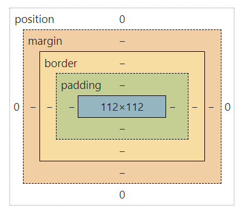

# CSS Study Note

## Introduction

```
/*This is a Declation block*/
  h1 {
    color: blue;
    text-align: center;
    font-size: 20px;
  }
```

`h1` is the Selector  
 `font-size` is the Property  
 after the "`:`" is the Value  
 `font-size: 20px` is a Declaration

## Inline CSS, Internal CSS and External CSS

### Inline CSS

```
<h1 style="color: blue">The text will be blue!</h1>
```

The effect of this code: <h1 style="color: blue">The text will be blue!</h1>

### Internal CSS

The effect is the same as last one

```
<head>
  <style>
    h1 {
      color: blue;
    }
  </style>
</head>
```

### External CSS

```
/* index.html */
<head>
  <link href="style.css" rel="stylesheet" />
</head>
```

```
/* style.css */
  h1 {
      color: blue;
    }
```

## Styling Text

```
h1 {
  color: blue;
  font-size: 26px;
  font-family: sans-serif;
  text-transform: uppercase;      /* transform lower word to upper*/
  font-style: italic;
  text-align: center;
}

p {
  line-height: 1.5;
}

```

## Combining Selectors

Create a list of Selectors

```
h1, h2, h3, h4, p, li {
  font-family: sans-serif;
}
```

Decendent Selector

```
footer p {
  font-size: 15px;
}
```

## Class and Selectors

### 1.Hash Selector

```
/*index.html*/
<h1 id="text">I am a text!</h1>


/*style.css*/
#text {
  /*Just write some decendent at here~*/
}
```

Never use `id` selector as long as you can!

### 2.Class

```
/*index.html*/
<h1 class="text">I am a text!</h1>


/*style.css*/
.text {
  /*Just write some decendent at here~*/
}
```

`id` name are not allowed to repeat, but `class` can do it

## Working with colors in CSS

css use the RGB model to represent color

### Color and Background-color

```
h1 {
  color: #ffffff;
}

p {
  background-color: white;
}
```

### Border

```
aside {
  border: 5px solid #444;
}

body {
  border-top: 5px solid #444;
  border-left: 5px solid #444;
  border-bottom: 5px solid #444;
}
```

## Pseudo-classes 伪类

```
/*index.html*/
<ul>
  <li>list-1</li>
  <li>list-2</li>
  <li>list-3</li>
</ul>
```

```
/*style.css*/
li:first-child {
  font-weight: bold;
}

li:last-child {
  font-style: italic;
}

li:nth-child(2) {
  color: red;
}/*2 is the second one, of course you can write any number in the ()*/

li:nth-child(even) {
  color: red;
}/*2 and 4 and ... 2n*/

article p:first-child {
  color: red;
}
```

## Styling Hyperlinks

```
a:link {
  text-decoration: none;
}

a:visited {

}

a:hover {
  text-decoration: underline dotted orangered;
  font-weight: bold;
}

a:active {
  background-color: black;
  font-style: italic;
}
```

## Using Chrome DevTools

OMIT..

## Conflict between Selectors

```
/*Priority: */
ID(#) selector
> Class(.) or pseudo-class(:) selector
> Element selector (p, div, li, etc.)
> Universal selector (*)
```

## Inheritance and the Universal Selector

```
* {
  margin: 0;
  padding: 0;
}
/*To initialize the layout of web page.*/
```

## The CSS Box Model



## Using Margins and Paddings

```
p {
  margin: 10px;
  padding: 10px;
}

.anyClass {
  margin-left: 10px;
  padding-bottom: 10px;
}

h1 {
  padding: 20px 40px;
}
/*
  top and bottom is 20px
  left and right is 40px
*/
```

## Adding Dimensions

```
<div style="background-color: orangered; height: 80px; width: 50px;"></div>
```

50px 80px

<div style="background-color: orangered; height: 80px; width: 50px;"></div>

To set image size in equal proportion

```
.img {
  width: 900px;
  height: auto;
}

.other-img {
  width: 100%;
  height: auto;
}
```

In the other-img class, the width is the 100% of the parent container.

## Centering our Page

We can use a dev called container to set all the page to center

```
/*index.html*/
<div class="container">
  <body>...</body>
</div>
```

```
/*style.css*/
.container {
  width: 800px;
  margin: 0 auto;
}

/*The margin-left and margin-right will be calculate by computer automatically!*/
```

## Types of Boxes

Block Level Element: `p`, `h`, `image`, `body`
Inline Level Element: `em`, `strong`, `a:link`
You can change the type of Boxes by the `display` property.

```
a:link {
  display: block;
}

li {
  display: inline;
}

p {
  display: inline-block;1
}
```

## Absolute Positioning

Positioning modes in CSS:`Normal Flow`, `Absolute Positioning`  
For example: you can use it to set the button on anywhere.

```
/*index.html*/
<body>
  <button>❤️Like<button/>
</body>
```

```
body {
  position: relative;
}

button {
  cursor: poointer;
  position: absolute;
  left: 0;
  top: 0;
}
```

Then the button will hover over the top-left corner of the web page.

## Pseudo-elements

### Pseudo-elements

```
h1::first-letter {
  font-style: normal;
  font-size: 80px;
}

p::first-line {
  color: red;
}
```

### Adjacent sibling selector

Sibling element is part of the same parent.0

```
h3 + p::first-line {
  color: red;
}
```

### After and Before Element

The after element can create an element to became the last element of the parent element.

```
h1::after {
  content: "TOP";
  background-color: yellow;
}
```

## Developer Skill `Debuggering` and `Asking Question`

You can use this web to check your error in your html file.

> https://validator.w3.org/#validate_by_input

Use this web to find the difference between two html file.

> https://www.diffchecker.com/
